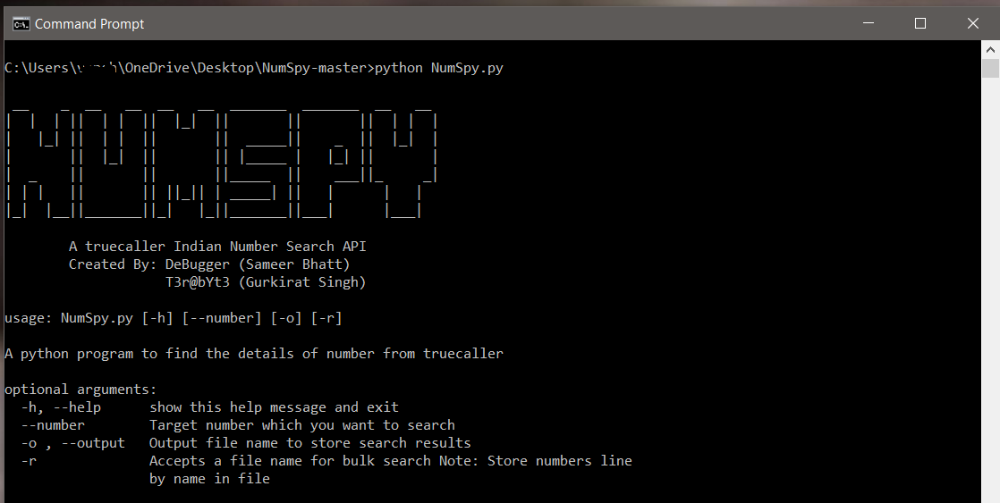
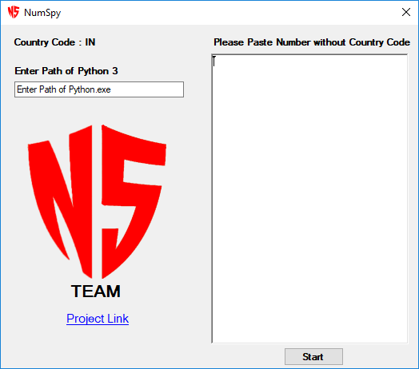

# new Numspy package is buit using python3 and available to install using pip check below link to go to new version of numspy.
</br>
<a href="https://github.com/bhattsameer/numspy">Numspy-0.1</a></br>

# NumSpy  [](http://www.python.org/download/)


Find details of any mobile number in india.
A TrueCaller Indian number Search ApI.

# Required
+ Python 3.x

# Setting Up NumSpy
1. install all the requirements
```
pip3 install --user -r requirements.txt
```

2. start the program
```
python3 NumSpy.py
```


# Scan Mobile number 
```
python3 NumSpy.py --number mobile_number
```

# Store Details into file
```
python3 NumSpy.py --number mobile_number -o output.txt
```

# GUI Version
```
Run NumSpy.exe file
```



# Help
```
python3 NumSpy.py -h
```

# TEAM
```
DeBugger (Sameer Bhatt)
T3r@bYt3 (Gurkirat Singh)
V1Ru5    (MohammadYahya)
#3rRY    (Hariom Panchal)
vaibhav0000patel (vaibhav Patel)
```

```
NOTE: We are not responsible for any thing you do with this script, This is just for learning and knowledge purpose.
```
